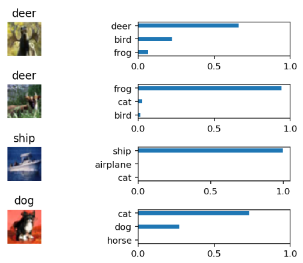
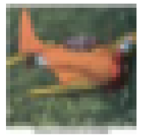
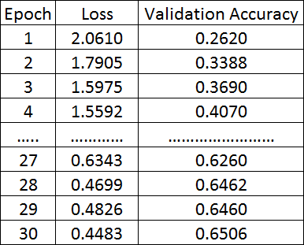
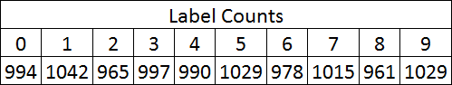
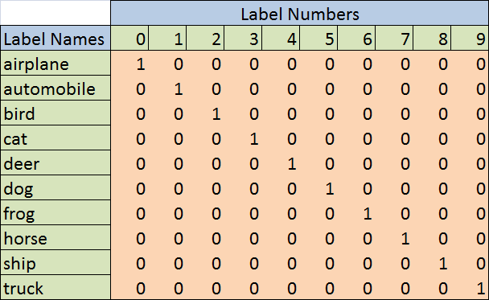

# Image_Classification
This repository contains project files for the ‘Image Classification’ project as part of Udacity's Machine Learning Engineer Nanodegree. The project can be viewed by opening 'image_classification.html' in a web browser, or can be run interactively by opening 'image_classification.ipynb' in a Jupyter Notebook.

In this project, I classify images from the CIFAR-10 dataset. The dataset consists of airplanes, dogs, cats, and other objects. I preprocess the images, then train a Convolutional Neural Network (CNN) on all the samples. The images are normalized and the labels are one-hot encoded. I build  convolutional, max pooling, dropout, and fully connected layers. In the end, I use the neural network to make predictions on the sample images.

## Screenshots
Below are a few screenshots showing features of this project.

